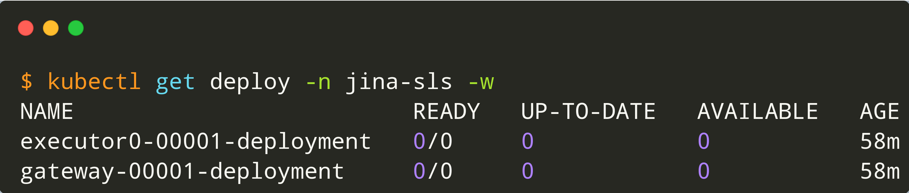

# jina-serverless-demo

```bash
bash setup.sh
```

This installs

- `kubectl`, `kind` & `linkerd` CLI if not installed.
- A local `kind` cluster named `jina-serverless`.
- Knative components
- Kourier Ingress for Knative
- Linkerd components
- Patch Knative & Kourier deployments with Linkerd service-mesh

Now that we have the setup done, let's use the jina CLI to export a dummy Flow yaml into K8S specific yamls.

```bash
jina export kubernetes flow.yml jina-sls --k8s-namespace jina-sls
```

Let's convert the K8S yamls to Knative yamls.

```bash
kubectl create namespace jina-sls
kubectl apply -R -f $(python kn/change_to_kn.py jina-sls)
```

```bash
GATEWAY=$(kubectl get ksvc -n jina-sls gateway --no-headers -o custom-columns="URL:.status.url")
echo -e "Flow Gateway is $GATEWAY"
```

Before any Client sends requests to the Gateway, let's check & wait until each deployment has 0 replicas.

<p align="center">
<a href="#"></a>
</p>

Let's start 10 concurrent Clients that will send requests to the Gateway. Each request is supposed to take 3 secs when a Flow is deployed with at least 1 replica.

```bash
python load.py 10
```

Note the following.

- As soon as we run the `load.py` script with 10 concurrent clients, new replicas of the `gateway` & `heavy_executor` start spawning.
- After a cool down period, all deployments reach the original state of 0 replicas each.

<p align="center">
<a href="#"></a>
</p>
