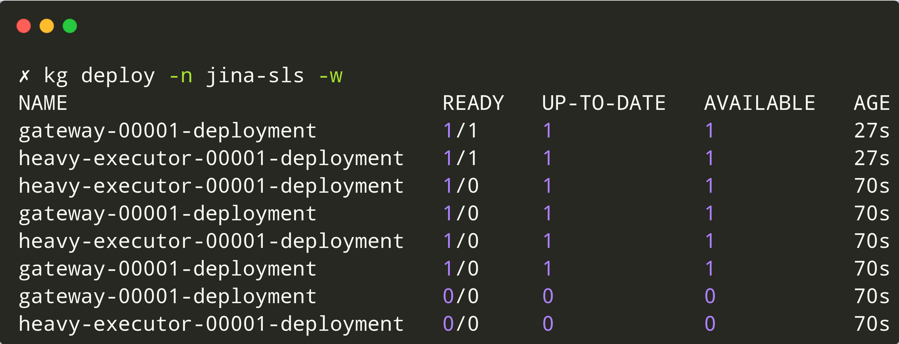
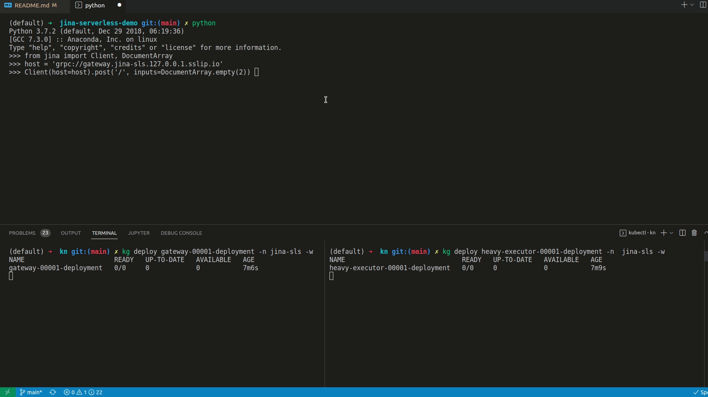
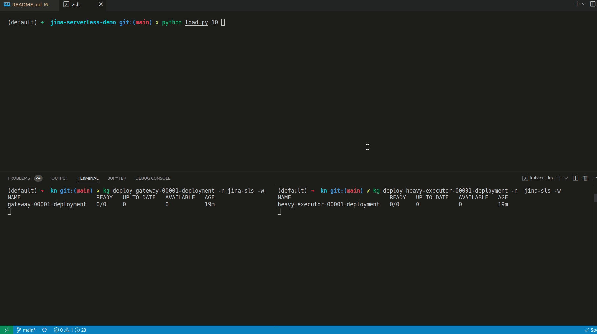

# jina & serverless

## What is serverless?

From [wikipedia](https://en.wikipedia.org/wiki/Serverless_computing)

> Serverless computing is a cloud computing execution model in which the cloud provider allocates machine resources on demand, taking care of the servers on behalf of their customers.
>
> "Serverless" is a misnomer in the sense that servers are still used by cloud service providers to execute code for developers. However, developers of serverless applications are not concerned with capacity planning, configuration, management, maintenance, fault tolerance, or scaling of containers, VMs, or physical servers.

## Why do we care?

- Scale-to-0 saves a lot of cost.
- Enables pay-per-use model of pricing.
- Many use cases in jina, which doesn't need Executors or Gateway to be always alive.
- Serverless allows invocations to be "event-driven". Though this demo only shows the event to be triggered by `jina.Client`, we can build different integrations where any [cloudevent](https://cloudevents.io/) can possibly be converted into a `jina.Client` request.

## What is this demo about?

We'll use [Knative serving](https://knative.dev/docs/) along with [Linkerd service mesh](https://linkerd.io/2.11/overview/) & show

- How does serverless work in a K8S world?
- How simple it is to enable autoscaling (from 0 to N) in jina?

## Why Knative?

Knative allows us to scale from 0 to N, based on.

- [concurrency](https://knative.dev/docs/serving/autoscaling/concurrency/) (`number of simultaneous requests per replica`) or,
- [rps](https://knative.dev/docs/serving/autoscaling/rps-target/) (`requests-per-second per replica`)
- We can set min / max number of replicas per deployment.
- It also supports HPA (CPU based 1-to-N scaling provided by K8S)

### Set-up

> You can skip this step if you already have a k8s cluster & setup knative / linkerd components.

Let's start by setting up a local environment where serverless machinery can be demonstrated. Following script installs

- `kubectl`, `kind` & `linkerd` CLI, if not already installed.
- A local `kind` cluster named `jina-serverless`.
- Knative components
- Kourier Ingress for Knative
- Linkerd components
- Patch Knative & Kourier deployments with Linkerd service-mesh

```bash
bash setup.sh
```

### Define an Executor & a Flow

We write a dummy `HeavyExecutor` which sleeps for 3 seconds every time it receives a new request. This can be replaced with any heavy Executor.

```python
# HeavyExecutor/executor.py
from jina import DocumentArray, Executor, requests

class HeavyExecutor(Executor):
    @requests
    def foo(self, docs: DocumentArray, **kwargs):
        time.sleep(3)
```

```yaml
# flow.yml
jtype: Flow
executors:
  - name: heavy_executor
    uses: jinahub+docker://HeavyExecutor
```

### Convert Flow to K8S yaml

Now that we have the setup done, let's use the jina CLI to export a dummy Flow yaml into K8S specific yamls.

```bash
jina export kubernetes flow.yml jina-sls --k8s-namespace jina-sls
```

### Convert to Knative yaml

> This step is temporary and should be implemented as a feature in core.

```python
f.to_k8s_yaml(dirpath, namespace, mode='knative')
# OR
f.to_knative_yaml(dirpath, namespace)
```

Knative doesn't understand K8S `Deployment` & `Service` resources and implements a `Service` resource under `serving.knative.dev/v1` CRD. Let's convert the K8S yamls to Knative yamls.

```bash
kubectl create namespace jina-sls
kubectl apply -R -f $(python kn/change_to_kn.py jina-sls)
```

We might need to wait a bit until all knative objects are setup in addition to the deployments in `jina-sls` namespace. Before any Client sends requests to the Gateway, let's check & wait until each deployment has 0 replicas.

<p align="center">
<a href="#"></a>
</p>

### Gateway URL

To check the URL of the Gateway, you can use the following command.

```bash
$ kubectl get ksvc -n jina-sls gateway --no-headers -o custom-columns="URL:.status.url"
http://gateway.jina-sls.127.0.0.1.sslip.io
```

Note that, the URL here is provided by Knative & hence starts with `http`. But it can accept all 3 protocols of requests supported by jina (gRPC, WebSockets & HTTP), just by passing the right [URL scheme](https://docs.jina.ai/fundamentals/flow/client/#connect:~:text=You%20can%20define%20these%20parameters%20by%20passing%20a%20valid%20URI%20scheme%20as%20part%20of%20the%20host%20argument%3A).

### Let's send requests to the Flow that doesn't exist!

Let's send just 1 Client request & keep an eye on the number of replicas per deployment.

```python
from jina import Client, DocumentArray

host = 'grpc://gateway.jina-sls.127.0.0.1.sslip.io'
Client(host=host).post('/', inputs=DocumentArray.empty(2))
```

We can observe new replicas popping up for both `gateway` & `heavy-executor` after request is sent via the Client.

<p align="center">
<a href="#"></a>
</p>

Now, let's start 10 concurrent Clients that will send requests to the Gateway.

```bash
python load.py 10
```

Note the following.

- As soon as we run the `load.py` script with 10 concurrent clients, new replicas of the `gateway` & `heavy-executor` start spawning.
- After a cool down period, all deployments reach the original state of 0 replicas each.

<p align="center">
<a href="#"></a>
</p>
